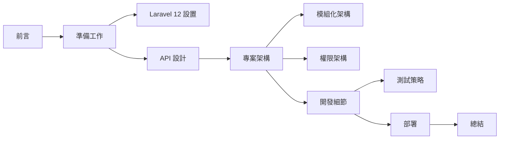

---
# https://vitepress.dev/reference/default-theme-home-page
layout: home

hero:
  name: "建置大型的 Laravel API 專案"
  text: "Pure API 架構設計指南"
  tagline: 從現代 Laravel 框架設置到生產部署的完整開發指南
  actions:
    - theme: brand
      text: 🚀 開始學習
      link: /pages/01-introduction
    - theme: alt
      text: ⚙️ 框架設置
      link: /pages/02-1-framework-setup
    - theme: alt
      text: 🏗️ 專案架構
      link: /pages/04-project-architecture

features:
  - icon: 🛠️
    title: 現代化準備工作
    details: 學習最新的 Laravel 框架設置、開發工具選擇、核心套件配置和環境準備
    link: /pages/02-preparation
    linkText: 開始準備
  - icon: 🎯
    title: Pure API 設計
    details: 掌握 OpenAPI 驅動開發、RESTful 原則、版本管理和 HATEOAS 超媒體設計
    link: /pages/03-api-design
    linkText: 學習設計
  - icon: 🏗️
    title: 模組化架構
    details: 建立可維護、可擴展的純 API 架構，包含模組化設計和權限系統
    link: /pages/04-project-architecture
    linkText: 設計架構
  - icon: 🧪
    title: 現代化開發
    details: 深入了解 Pest 測試框架、Data Objects、API 認證和模組化實作
    link: /pages/05-development-details
    linkText: 開發實作
  - icon: 🚀
    title: 生產部署
    details: 使用 CI/CD、Docker、Kubernetes 和 GitOps 建立自動化部署流程
    link: /pages/06-deployment
    linkText: 學習部署
  - icon: 🎊
    title: 總結與最佳實踐
    details: 整合所有知識點，掌握 Laravel 12 API 專案的成功關鍵因素
    link: /pages/07-conclusion
    linkText: 查看總結
---

## 🌟 專案特色

### ⚡ Laravel 現代化架構
- **最新框架** - 基於 Laravel 12+，繼承 Laravel 11 的架構簡化優勢
- **簡化配置** - 中央化配置管理，更清晰的專案結構
- **純 API 設計** - 專注於 API 服務，無 Web UI 干擾
- **模組化開發** - 使用 nWidart/laravel-modules 實現高內聚、低耦合

### 🔐 企業級權限系統
- **RBAC 架構** - 基於 binary-cats/laravel-rbac 的完整權限控制
- **枚舉驅動** - 使用 PHP 8.1+ 枚舉提供類型安全的權限定義
- **多 Guard 支援** - 同時支援 Sanctum API 認證和 Web 認證

### 🧪 現代化測試策略
- **Pest 框架** - 優雅的 PHP 測試框架，提供更好的開發體驗
- **並行執行** - 內建並行測試支援，提升測試效率
- **完整覆蓋** - 單元測試、功能測試、整合測試和權限測試

### 📊 強型別資料處理
- **Data Objects** - 使用 spatie/laravel-data 實現強型別資料傳輸
- **自動驗證** - 內建驗證和轉換功能
- **TypeScript 支援** - 支援自動產生 TypeScript 型別定義

## 🎯 適用對象

### 👩‍💻 後端開發者
- 想要學習 Laravel 12 最新特性
- 需要建立大型 API 專案的開發者
- 希望掌握模組化架構設計的工程師

### 🏢 技術團隊
- 計畫採用 Laravel 建立企業級 API 的團隊
- 需要建立可擴展、可維護架構的公司
- 重視程式碼品質和測試覆蓋率的組織

### 🎓 學習者
- 想要深入學習 Laravel 進階概念
- 對現代 PHP 開發感興趣的學習者
- 希望了解企業級專案架構的開發者

## 📚 學習路徑

## 🛠️ 技術棧

| 組件 | 技術選擇 | 版本 |
|------|----------|------|
| **核心框架** | Laravel | 12.x |
| **PHP 版本** | PHP | 8.2 - 8.4 |
| **API 認證** | Laravel Sanctum | 4.x |
| **模組化** | nWidart/laravel-modules | 12.x |
| **權限管理** | binary-cats/laravel-rbac | 1.5+ |
| **資料處理** | spatie/laravel-data | 4.17+ |
| **測試框架** | Pest | 3.x |
| **資料庫** | MySQL/PostgreSQL | 8.0+/13+ |
| **快取** | Redis | 5.0+ |

## 🎉 開始您的學習旅程

選擇適合您的起點：

- **🆕 新手入門** [前言](./pages/01-introduction.md)
- **⚙️ 快速設置** [Laravel 框架設置](./pages/02-1-framework-setup.md)
- **🏗️ 架構設計** [專案架構](./pages/04-project-architecture.md)
- **🧪 測試先行** [測試框架配置](./pages/05-1-testing.md)

