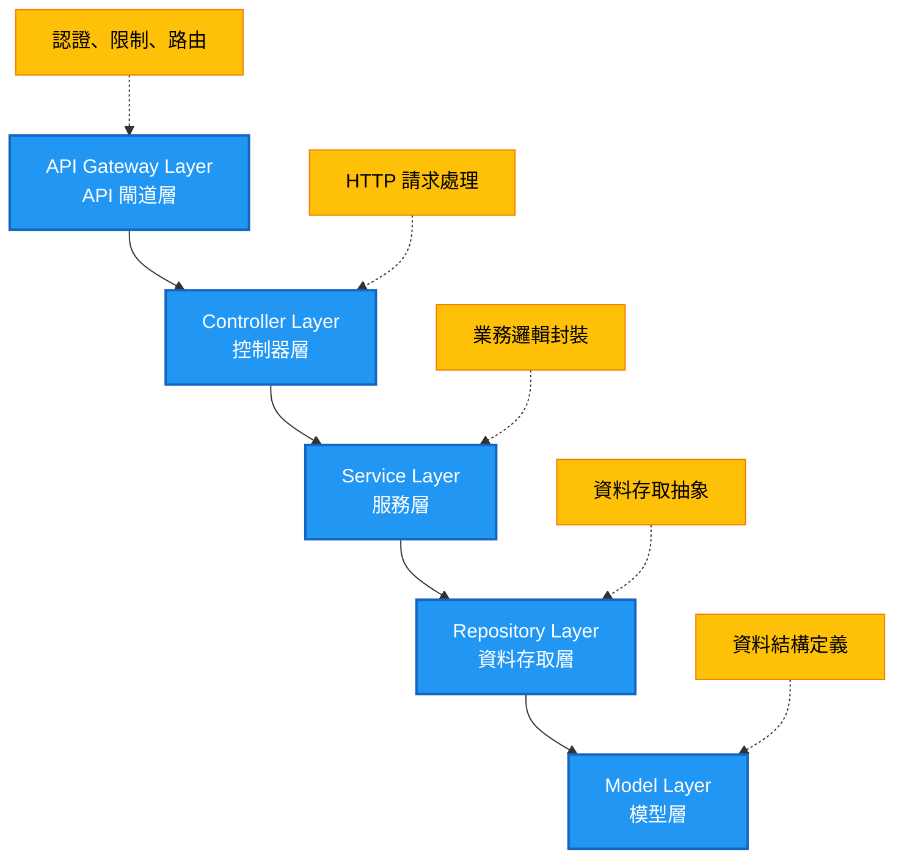

# 設計專案架構

在大型 Laravel API 專案中，良好的架構設計是確保專案可維護性、可擴展性和團隊協作效率的關鍵。本章將介紹純 API 專案的架構設計理念和實作策略。

## 🎯 Pure API 架構理念

### 設計理念
- **API First** - 所有功能都透過 API 提供
- **模組化** - 使用 nWidart/laravel-modules 實現功能模組化
- **HATEOAS** - 支援超媒體作為應用程式狀態引擎
- **事件驅動** - 模組間透過事件進行鬆散耦合的通訊
- **契約導向** - 使用介面契約定義模組間的依賴關係

### 核心優勢
- **專注性** - 專注於 API 服務，無 Web UI 干擾
- **效能** - 移除不必要的 Web 中間件和組件
- **可擴展性** - 模組化設計支援水平擴展
- **維護性** - 清晰的架構邊界，降低維護成本
- **靈活性** - 支援多種前端技術棧

### 技術棧選擇

| 技術 | 版本 | 用途 | 選擇原因 |
|------|------|------|----------|
| **Laravel** | 12.x | 核心框架 | 成熟的 PHP 框架，強大的 API 支援 |
| **Laravel Sanctum** | 4.x | API 認證 | 輕量級 API token 認證，適合 SPA 和行動應用 |
| **nWidart/laravel-modules** | 12.x | 模組化管理 | 完善的模組化解決方案 |
| **spatie/laravel-data** | 4.17+ | Data Objects 管理 | 強型別資料傳輸，內建驗證功能 |
| **binary-cats/laravel-rbac** | 1.5+ | 權限管理 | 完整的 RBAC 實現 |
| **Pest** | 3.x | 測試框架 | 現代化的 PHP 測試框架 |

## 🏗️ 版本化專案結構

因應 API 版本，我們需要一個版本化的專案結構來管理不同版本的 API。這樣可以確保每個版本的 API 都有自己的路由、控制器和邏輯等。

### 版本化的重要性
- **向後相容性** - 舊版本 API 持續服務現有客戶端
- **漸進式升級** - 客戶端可以按自己的節奏升級
- **風險控制** - 新版本問題不影響舊版本
- **測試隔離** - 不同版本可以獨立測試

### 專案目錄結構
```
laravel-api-project/
├── app/
│   ├── Http/
│   │   ├── Controllers/
│   │   │   └── API/
│   │   │       ├── V1/          # Version 1 API Controllers
│   │   │       └── V2/          # Version 2 API Controllers
│   │   ├── Requests/
│   │   │   ├── V1/             # Version 1 Requests
│   │   │   └── V2/             # Version 2 Requests
│   │   └── Resources/
│   │       ├── V1/             # Version 1 API Resources
│   │       └── V2/             # Version 2 API Resources
│   ├── Models/                 # Shared Models
│   ├── Services/               # Business Logic Services
│   ├── Data/                   # Data Transfer Objects
│   └── Shared/                 # Shared Components
│       ├── Contracts/          # Interface Contracts
│       ├── Services/           # Shared Services
│       └── Traits/             # Reusable Traits
├── modules/                    # Feature Modules
│   ├── User/                   # User Management Module
│   ├── Profile/                # Profile Management Module
│   ├── Authentication/         # Auth Module
│   └── Notification/           # Notification Module
├── config/
├── database/
├── routes/
│   ├── api.php                 # Main API Routes
│   └── v1.php, v2.php          # Version-specific routes
└── tests/
    ├── Feature/
    │   ├── API/
    │   │   ├── V1/             # V1 API Tests
    │   │   └── V2/             # V2 API Tests
    │   └── Modules/            # Module Tests
    └── Unit/                   # Unit Tests
```
- 清晰的職責分工
- 易於測試和維護
- 支援依賴注入和反轉控制
- 提高程式碼的可讀性

## 🔧 多層式架構設計

### 架構分層


### 各層職責定義

#### 1. API 端點層 (Routes)
```php
// routes/api.php
Route::middleware(['auth:sanctum'])->prefix('v1')->group(function () {
    Route::apiResource('users', UserController::class);
    Route::apiResource('profiles', ProfileController::class);
});

// routes/v1.php - 版本專用路由
Route::group(['middleware' => ['auth:sanctum', 'throttle:api']], function () {
    Route::get('/users', [V1\UserController::class, 'index']);
    Route::post('/users', [V1\UserController::class, 'store']);
});
```

#### 2. 控制器層 (Controllers)
```php
// app/Http/Controllers/API/V1/UserController.php
class UserController extends Controller
{
    public function __construct(
        private UserService $userService
    ) {
        $this->middleware('auth:sanctum');
    }

    public function index(IndexUserRequest $request): JsonResponse
    {
        $users = $this->userService->getAllUsers($request->validated());
        
        return response()->json([
            'message' => 'Users retrieved successfully',
            'data' => UserResource::collection($users),
            'meta' => [
                'total' => $users->total(),
                'current_page' => $users->currentPage(),
            ]
        ]);
    }
}
```

#### 3. 服務層 (Services)
```php
// app/Services/UserService.php
class UserService
{
    public function __construct(
        private UserRepositoryInterface $userRepository,
        private ProfileServiceInterface $profileService
    ) {}

    public function createUser(CreateUserData $data): UserData
    {
        DB::beginTransaction();
        
        try {
            // 創建用戶
            $user = $this->userRepository->create($data->toArray());
            
            // 觸發事件
            event(new UserCreated($user->id, $user->email, $data->toArray()));
            
            // 自動創建基本個人資料
            $this->profileService->createDefaultProfile($user->id);
            
            DB::commit();
            
            return UserData::from($user);
        } catch (Exception $e) {
            DB::rollBack();
            throw $e;
        }
    }
}
```

#### 4. 資料存取層 (Repositories)
```php
// app/Repositories/EloquentUserRepository.php
class EloquentUserRepository implements UserRepositoryInterface
{
    public function create(array $data): User
    {
        return User::create([
            'name' => $data['name'],
            'email' => $data['email'],
            'password' => Hash::make($data['password']),
        ]);
    }

    public function findById(int $id): ?User
    {
        return User::find($id);
    }

    public function getAllPaginated(array $filters = [], int $perPage = 15): LengthAwarePaginator
    {
        $query = User::query();

        if (!empty($filters['search'])) {
            $query->where('name', 'like', "%{$filters['search']}%")
                  ->orWhere('email', 'like', "%{$filters['search']}%");
        }

        return $query->paginate($perPage);
    }
}
```

#### 5. 模型層 (Models)
```php
// app/Models/User.php
class User extends Authenticatable implements MustVerifyEmail
{
    use HasApiTokens, HasRoles, Notifiable;

    protected $fillable = [
        'name', 'email', 'password',
    ];

    protected $hidden = [
        'password', 'remember_token',
    ];

    protected $casts = [
        'email_verified_at' => 'datetime',
        'password' => 'hashed',
    ];

    // 關聯定義
    public function profile(): HasOne
    {
        return $this->hasOne(Profile::class);
    }

    // 業務邏輯方法
    public function getFullNameAttribute(): string
    {
        return $this->name;
    }
}
```

## 🔄 模組化開發策略

模組化開發將大型專案拆分成獨立的功能模組，每個模組負責特定的業務領域。

### 模組設計原則

#### 1. 高內聚、低耦合
```php
// 模組內部高度聚合
modules/User/
├── Http/Controllers/    # 用戶相關控制器
├── Services/           # 用戶業務邏輯
├── Models/            # 用戶資料模型
├── Events/            # 用戶相關事件
└── Tests/             # 用戶功能測試

// 模組間低耦合通訊
// 通過事件而非直接調用
event(new UserCreated($user));  // ✅ 好的做法
$profileModule->createProfile($user); // ❌ 避免直接調用
```

#### 2. 介面契約設計
```php
// app/Shared/Contracts/UserServiceInterface.php
interface UserServiceInterface
{
    public function findUser(int $id): ?UserData;
    public function createUser(CreateUserData $data): UserData;
    public function updateUser(int $id, UpdateUserData $data): UserData;
    public function deleteUser(int $id): bool;
}

// 模組實作介面
// modules/User/Services/UserService.php
class UserService implements UserServiceInterface
{
    // 實作介面方法
}
```

### 模組通訊機制

#### 1. 事件驅動通訊
```php
// 發布事件
// modules/User/Services/UserService.php
public function createUser(CreateUserData $data): UserData
{
    $user = $this->userRepository->create($data->toArray());
    
    // 發布用戶創建事件
    event(new UserCreated(
        userId: $user->id,
        email: $user->email,
        userData: $data->toArray()
    ));
    
    return UserData::from($user);
}

// 監聽事件
// modules/Profile/Listeners/CreateUserProfile.php
class CreateUserProfile
{
    public function handle(UserCreated $event): void
    {
        $this->profileService->createDefaultProfile($event->userId);
    }
}

// modules/Notification/Listeners/SendWelcomeEmail.php
class SendWelcomeEmail
{
    public function handle(UserCreated $event): void
    {
        $this->emailService->sendWelcomeEmail($event->email);
    }
}
```

#### 2. 共用資料層
```php
// app/Shared/Data/ - 跨模組共用的 Data Objects
class UserData extends Data
{
    public function __construct(
        public readonly int $id,
        public readonly string $name,
        public readonly string $email,
        public readonly ?Carbon $email_verified_at,
        public readonly Carbon $created_at,
    ) {}
}

// 模組間可以安全地傳遞和使用這些 Data Objects
```

## 🔗 服務層架構

服務層是業務邏輯的核心，負責協調不同組件完成複雜的業務流程。

### 服務層職責
- **業務邏輯封裝** - 將複雜的業務規則集中管理
- **事務管理** - 協調多個資料操作的一致性
- **外部服務整合** - 處理第三方 API 調用
- **事件發布** - 觸發系統內的業務事件

### 服務實作範例
```php
// app/Services/UserManagementService.php
class UserManagementService
{
    public function __construct(
        private UserRepositoryInterface $userRepository,
        private ProfileServiceInterface $profileService,
        private NotificationServiceInterface $notificationService
    ) {}

    public function registerUser(RegisterUserData $data): UserData
    {
        DB::beginTransaction();
        
        try {
            // 1. 創建用戶
            $user = $this->userRepository->create($data->toArray());
            
            // 2. 創建基本個人資料
            $profile = $this->profileService->createDefaultProfile($user->id);
            
            // 3. 發送歡迎郵件
            $this->notificationService->sendWelcomeEmail($user->email);
            
            // 4. 觸發用戶註冊事件
            event(new UserRegistered($user->id, $user->email));
            
            DB::commit();
            
            return UserData::from($user);
            
        } catch (Exception $e) {
            DB::rollBack();
            
            Log::error('User registration failed', [
                'email' => $data->email,
                'error' => $e->getMessage()
            ]);
            
            throw new UserRegistrationException('Failed to register user', 0, $e);
        }
    }
}
```

## 📊 API 資源層設計

API 資源層負責將內部資料結構轉換為對外的 API 回應格式。

### 資源轉換策略
```php
// app/Http/Resources/V1/UserResource.php
class UserResource extends JsonResource
{
    public function toArray($request): array
    {
        return [
            'id' => $this->id,
            'name' => $this->name,
            'email' => $this->email,
            'email_verified_at' => $this->email_verified_at?->toISOString(),
            'created_at' => $this->created_at->toISOString(),
            'updated_at' => $this->updated_at->toISOString(),
            
            // 條件式欄位
            'profile' => $this->whenLoaded('profile', function () {
                return ProfileResource::make($this->profile);
            }),
            
            // 權限相關欄位
            'permissions' => $this->when(
                $request->user()?->hasApiPermission('user:viewPermissions'),
                fn() => $this->getApiPermissions()
            ),
            
            // HATEOAS 連結
            'links' => [
                'self' => route('api.v1.users.show', $this->id),
                'profile' => route('api.v1.profiles.show', $this->profile?->id),
                'update' => $this->when(
                    $request->user()?->can('update', $this->resource),
                    route('api.v1.users.update', $this->id)
                ),
            ],
        ];
    }
}

// 集合資源
class UserCollection extends ResourceCollection
{
    public function toArray($request): array
    {
        return [
            'data' => $this->collection,
            'meta' => [
                'total' => $this->total(),
                'count' => $this->count(),
                'per_page' => $this->perPage(),
                'current_page' => $this->currentPage(),
                'total_pages' => $this->lastPage(),
            ],
            'links' => [
                'first' => $this->url(1),
                'last' => $this->url($this->lastPage()),
                'prev' => $this->previousPageUrl(),
                'next' => $this->nextPageUrl(),
            ],
        ];
    }
}
```

## 📁 目錄組織最佳實踐

### 清晰的目錄分離
```
app/
├── Http/
│   ├── Controllers/
│   │   └── API/
│   │       ├── V1/             # 版本 1 控制器
│   │       │   ├── UserController.php
│   │       │   └── ProfileController.php
│   │       └── V2/             # 版本 2 控制器
│   ├── Requests/
│   │   ├── V1/                 # 版本 1 請求驗證
│   │   └── V2/                 # 版本 2 請求驗證
│   ├── Resources/
│   │   ├── V1/                 # 版本 1 API 資源
│   │   └── V2/                 # 版本 2 API 資源
│   └── Middleware/             # 中間件
├── Services/                   # 業務邏輯服務
├── Repositories/               # 資料存取層
├── Data/                       # Data Transfer Objects
├── Models/                     # Eloquent 模型
├── Events/                     # 事件定義
├── Listeners/                  # 事件監聽器
├── Jobs/                       # 佇列工作
├── Exceptions/                 # 自定義例外
└── Shared/                     # 共用組件
    ├── Contracts/              # 介面契約
    ├── Services/               # 共用服務
    ├── Traits/                 # 重用特徵
    └── Enums/                  # 列舉定義
```

這種架構設計的優勢：
- **清晰的職責分離** - 每一層都有明確的職責
- **高度可測試性** - 可以獨立測試每一層
- **易於維護** - 修改某一層不影響其他層
- **支援團隊協作** - 不同開發者可以並行開發不同層級
- **版本化支援** - 支援 API 版本管理和向後相容性

---

**深入學習：**
- [模組化架構設計](04-1-modular-architecture.md)
- [API 權限架構設計](04-2-permission-architecture.md)

**下一步：** 了解開發實作細節 → [開發細節](05-development-details.md)
